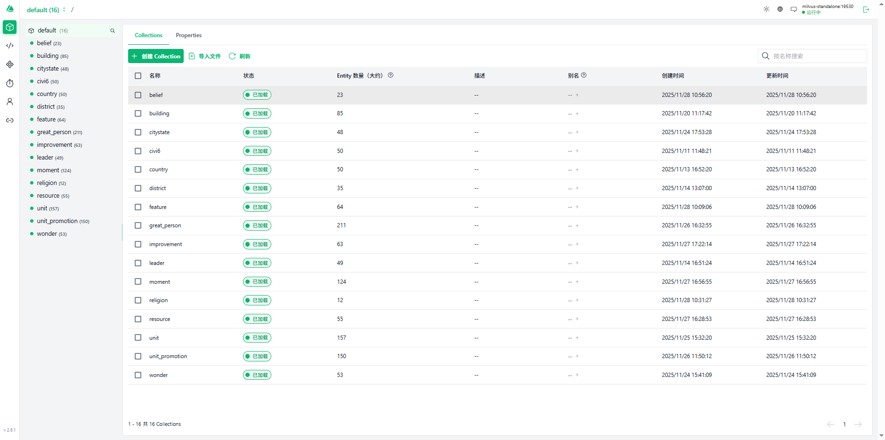

+++
title = '文明6 RAG 知识库实战：从爬取到问答'
date = 2025-12-29T17:43:40+08:00
draft = false
tags = ['RAG', 'LangChain', 'Milvus', 'FastAPI', 'Ollama', 'Civ6']
categories = ['AI 应用']
summary = '基于文明6百科构建 RAG：数据爬取、向量化、检索路由与生成，并拆解每个关键方法的设计与含义。'
+++

## 项目概览

本文讲解如何基于 Civilopedia 构建《文明 6》主题的 RAG（检索增强生成）问答系统：爬取 → 清洗拆分 → 向量化入库（Milvus）→ 路由判定多路检索 → 模型生成答案，并逐个方法拆解其设计与含义。

## 技术栈与部署

- 运行环境：Python 3.11，Docker
- 框架组件：LangChain（链路与组件）、FastAPI（对外 API）
- 模型：聊天模型 gpt-oss:120b-cloud、llama3.1；嵌入模型 embeddinggemma
- 向量数据库：Milvus（本地/远程）

## 数据爬取（方法拆解）

目标来源为 Civilopedia：https://www.civilopedia.net。以下示例展示伟人页面的采集与解析流程，拆解为：1) 构造采集清单；2) 解析页面；3) 封装入库文档。

```python
great_persons = [
    "alvar_aalto",
    "ada_lovelace",
    "bi_sheng",
    "charles_correa",
    "kenzo_tange",
    "filippo_brunelleschi",
    "gustave_eiffel",
    "jane_drew",
    "leonardo_da_vinci",
    "robert_goddard",
    "isidore_of_miletus",
    "mimar_sinan",
    "nikola_tesla",
    "shah_jahan",
    "james_of_st_george",
    "wernher_von_braun",
    "sergei_korolev",
    "imhotep",
    "john_a_roebling",
    "joseph_paxton",
    "james_watt",
    "ahmad_shah_massoud",
    "ana_nzinga",
    "aethelflaed",
    "el_cid",
    "boudica",
    "dandara",
    "douglas_macarthur",
    "dwight_eisenhower",
    "georgy_zhukov",
    "gustavus_adolphus",
    "hannibal_barca",
    "simon_bolivar",
    "marina_raskova",
    "napoleon_bonaparte",
    "samori_ture",
    "joan_of_arc",
    "sudirman",
    "sun_tzu",
    "timur",
    "tupac_amaru",
    "vijaya_wimalaratne",
    "john_monash",
    "rani_lakshmibai",
    "trung_trac",
    "abdus_salam",
    "albert_einstein",
    "alfred_nobel",
    "alan_turing",
    "aryabhata",
    "erwin_schrodinger",
    "emilie_du_chatelet",
    "abu_al_qasim_al_zahrawi",
    "isaac_newton",
    "omar_khayyam",
    "hildegard_of_bingen",
    "charles_darwin",
    "dmitri_mendeleev",
    "janaki_ammal",
    "carl_sagan",
    "margaret_mead",
    "mary_leakey",
    "euclid",
    "stephanie_kwolek",
    "hypatia",
    "ibn_khaldun",
    "james_young",
    "zhang_heng",
    "galileo_galilei",
    "helena_rubinstein",
    "jamsetji_tata",
    "masaru_ibuka",
    "colaeus",
    "raja_todar_mal",
    "levi_strauss",
    "mary_katherine_goddard",
    "marco_polo",
    "marcus_licinius_crassus",
    "melitta_bentz",
    "piero_de_bardi",
    "giovanni_de_medici",
    "sarah_breedlove",
    "stamford_raffles",
    "jakob_fugger",
    "estee_lauder",
    "adam_smith",
    "ibn_fadlan",
    "irene_of_athens",
    "john_rockefeller",
    "john_spilsbury",
    "john_jacob_astor",
    "zhang_qian",
    "zhou_daguan",
    "amrita_sher_gil",
    "el_greco",
    "edmonia_lewis",
    "andrey_rublev",
    "angelica_kauffman",
    "boris_orlovsky",
    "hasegawa_tohaku",
    "qiu_ying",
    "donatello",
    "katsushika_hokusai",
    "gustav_klimt",
    "kamal_ud_din_behzad",
    "claude_monet",
    "rembrandt_van_rijn",
    "mary_cassatt",
    "marie_anne_collot",
    "michelangelo",
    "sofonisba_anguissola",
    "titian",
    "wassily_kandinsky",
    "vincent_van_gogh",
    "hieronimus_bosch",
    "jang_seung_eop",
    "antonin_dvorak",
    "antonio_carlos_gomez",
    "antonio_vivaldi",
    "yatsuhashi_kengyo",
    "peter_ilyich_tchaikovsky",
    "dimitrie_cantemir",
    "franz_liszt",
    "frederic_chopin",
    "gauhar_jaan",
    "juventino_rosas",
    "clara_schumann",
    "liliuokalani",
    "liu_tianhua",
    "ludwig_van_beethoven",
    "mykola_leontovych",
    "scott_joplin",
    "wolfgang_amadeus_mozart",
    "johann_sebastian_bach",
    "adi_shankara",
    "francis_of_assisi",
    "irenaeus",
    "haji_huud",
    "confucius",
    "laozi",
    "martin_luther",
    "madhva_acharya",
    "bodhidharma",
    "john_the_baptist",
    "songtsan_gampo",
    "zoroaster",
    "o_no_yasumaro",
    "thomas_aquinas",
    "simon_peter",
    "siddhartha_gautama",
    "edgar_allen_poe",
    "emily_dickinson",
    "ovid",
    "bhasa",
    "beatrix_potter",
    "f_scott_fitzgerald",
    "homer",
    "hg_wells",
    "gabriela_mistral",
    "jane_austen",
    "geoffrey_chaucer",
    "karel_capek",
    "rabindranath_tagore",
    "li_bai",
    "leo_tolstoy",
    "rumi",
    "margaret_cavendish",
    "mary_shelley",
    "marie_catherine_d_aulnoy",
    "mark_twain",
    "miguel_de_cervantes",
    "niccolo_machiavelli",
    "qu_yuan",
    "william_shakespeare",
    "alexander_pushkin",
    "valmiki",
    "johann_wolfgang_von_goethe",
    "james_joyce",
    "murasaki_shikibu",
    "artemisia",
    "togo_heihachiro",
    "franz_von_hipper",
    "francis_drake",
    "gaius_duilius",
    "grace_hopper",
    "hanno_the_navigator",
    "horatio_nelson",
    "clancy_fernando",
    "rajendra_chola",
    "laskarina_bouboulina",
    "leif_erikson",
    "yi_sun_sin",
    "matthew_perry",
    "chester_nimitz",
    "joaquim_marques_lisboa",
    "santa_cruz",
    "themistocles",
    "himerios",
    "sergey_gorshkov",
    "zheng_he",
    "ching_shih",
    "ferdinand_magellan",
    "commandante_jose_de_sucre",
    "commandante_narino",
    "commandante_paula_santander",
    "commandante_macgregor",
    "commandante_antonio_paez",
    "commandante_ribas",
    "commandante_urdaneta",
    "commandante_montilla",
    "commandante_piar",
    "commandante_marino"
]
from bs4 import BeautifulSoup
from langchain_core.documents import Document
from langchain_text_splitters import RecursiveCharacterTextSplitter
from langchain_community.vectorstores import Milvus
from langchain_ollama import OllamaEmbeddings
import requests
base_url='https://www.civilopedia.net/zh-CN/gathering-storm/greatpeople/great_person_individual_'
docs=[]
for item in great_persons:
    url=f"{base_url}{item}"
    print(url)
    response=requests.get(url)
    if response.status_code==404:
        continue

soup=BeautifulSoup(response.content,'html.parser')
    name=soup.find('div',class_='App_pageHeaderText__SsfWm App_mainTextColor__6NGqD App_mainTextColor__6NGqD').get_text(strip=True)
    print(name)
    special_ablities=[]
    special_elem=soup.find('div',class_='App_pageLeftColumn__huW_2')
    if len(special_elem.find_all('div',class_='App_leftColumnItem__GHlpJ'))>2:
     special_ability_1=special_elem.find_all('div',class_='App_leftColumnItem__GHlpJ')[2] if special_elem else None
    
     special_ablities.append(special_ability_1.find('p',class_='Component_headerBodyHeaderText__LuO9w App_mainTextColor__6NGqD').get_text(strip=True) if special_ability_1.find('p',class_='Component_headerBodyHeaderText__LuO9w App_mainTextColor__6NGqD') else special_ability_1.find('div',class_='Component_headerBodyHeaderText__LuO9w App_mainTextColor__6NGqD').get_text(strip=True) if special_ability_1.find('div',class_='Component_headerBodyHeaderText__LuO9w App_mainTextColor__6NGqD') else '' )
     special_ablities.append(special_ability_1.find('p',class_='Component_headerBodyHeaderBody__MkvCp App_mainTextColor__6NGqD').get_text(strip=True) if special_ability_1.find('p',class_='Component_headerBodyHeaderBody__MkvCp App_mainTextColor__6NGqD') else special_ability_1.find('div',class_='Component_headerBodyHeaderBody__MkvCp App_mainTextColor__6NGqD').get_text(strip=True) if special_ability_1.find('div',class_='Component_headerBodyHeaderBody__MkvCp App_mainTextColor__6NGqD') else '' )
    if len(special_elem.find_all('div',class_='App_leftColumnItem__GHlpJ'))>3:
     special_ability_2=special_elem.find_all('div',class_='App_leftColumnItem__GHlpJ')[3]
     special_ablities.append(special_ability_2.find('p',class_='Component_headerBodyHeaderText__LuO9w App_mainTextColor__6NGqD').get_text(strip=True) if special_ability_2.find('p',class_='Component_headerBodyHeaderText__LuO9w App_mainTextColor__6NGqD') else special_ability_2.find('div',class_='Component_headerBodyHeaderText__LuO9w App_mainTextColor__6NGqD').get_text(strip=True) if special_ability_2.find('div',class_='Component_headerBodyHeaderText__LuO9w App_mainTextColor__6NGqD') else '' )
     special_ablities.append(special_ability_2.find('p',class_='Component_headerBodyHeaderBody__MkvCp App_mainTextColor__6NGqD').get_text(strip=True) if special_ability_2.find('p',class_='Component_headerBodyHeaderBody__MkvCp App_mainTextColor__6NGqD') else special_ability_2.find('div',class_='Component_headerBodyHeaderBody__MkvCp App_mainTextColor__6NGqD').get_text(strip=True) if special_ability_2.find('div',class_='Component_headerBodyHeaderBody__MkvCp App_mainTextColor__6NGqD') else '' )

    special_ablities_text="\n".join(special_ablities)
    print(special_ablities_text)

    duty_elem=soup.find_all('div',class_='StatBox_statBoxFrame__Cgdpy')[0]
    duties=[]
    for item in duty_elem.find_all('div',class_='StatBox_statBoxComponent__M3Gcj') if duty_elem else []:
        duties.append(item.get_text(strip=True))
    duty_text="\n".join(duties)
    print(duty_text)
    doc=Document(
        page_content=f"伟人姓名:{name}\n特色能力:{special_ablities_text}\n身份:{duty_text}",
        metadata={"source":url}
    )
    docs.append(doc)

text_splitter=RecursiveCharacterTextSplitter(chunk_size=1000,chunk_overlap=200)
split_docs=text_splitter.split_documents(docs)
embeddings=OllamaEmbeddings(model="embeddinggemma")
vector_store=Milvus.from_documents(split_docs,embedding=embeddings,connection_args={"host":"localhost","port":"19530"},collection_name="great_person")
```

## 方法含义与提示

环境变量：
- `CIVI6_OLLAMA_HOST`：Ollama 服务器地址（含端口）。
- `MILVUS_HOST` / `MILVUS_PORT`：Milvus 服务地址与端口。

## 向量数据库

我将文明6的数据信息，分成了几张表如图(宗教，建筑，国家等)



## 正式代码

核心思路：先判定问题涉及的主题表（如宗教/建筑/国家等），为每个表构造检索器并行召回上下文，最后交由生成模型整合回答。

```python
from fastapi import FastAPI
from pydantic import BaseModel, Field
from typing import List, Literal
import os
from langchain_ollama import ChatOllama, OllamaEmbeddings
from langchain_core.prompts import ChatPromptTemplate
from langchain_core.output_parsers import StrOutputParser
from langchain_core.runnables import RunnableParallel

from lib import get_vectorstore_from_milvus, generate_answer_by_multiple_retriever

app = FastAPI()


class AskRequest(BaseModel):
    question: str


class AskResponse(BaseModel):
    answer: str


class RouteQuery(BaseModel):
    tables: List[Literal[
        "belief", "religion", "country", "leader", "building", "wonder",
        "resource", "citystate", "district", "feature", "great_person",
        "improvement", "moment", "unit", "unit_promotion"
    ]] = Field(description="这个问题与哪些关键字有关，返回对应的表名")


def generate_answer(question: str) -> str:
    """
    根据用户的问题，生成文明6相关的答案
    """

    template = """
    你是一个文明6的助手，根据用户的问题，判断应该查询哪些数据库表，表有以下几种：[]belief,religion,country,leader,building,citystate,country,district,feature,great_person,improvement,moment,resource,unit,unit_promotion,wonder]，
请你判断用户的问题应该查询哪些表，返回格式为json，字段为tables，值为一个数组，数组元素为表名。
重要规则（必须遵守）：
- 禁止以任何形式进行省略，包括但不限于：
  - “为避免篇幅过长”
  - “以下内容已省略”
  - “部分内容略”
  - “……”
- 必须完整输出所有检索到的内容，不允许合并，不允许跳过，不允许折叠。
- 只要上下文里有多少条，就必须全部原样列出。
- 输出不完整视为错误。

用户的问题是：{question}
    
    """

    prompt = ChatPromptTemplate.from_template(template)
    llm = ChatOllama(model="gpt-oss:120b-cloud",base_url='https://ollama.com:443')
    chain = prompt | llm | StrOutputParser()
    response = chain.invoke({"question": question})

    # 换成可靠的 JSON 模型
    structured_llm = ChatOllama(model="llama3.1", base_url=os.getenv("CIVI6_OLLAMA_HOST"))
    structured_chain = structured_llm.with_structured_output(RouteQuery)
    result = structured_chain.invoke(response)

    embeddings = OllamaEmbeddings(model="embeddinggemma", base_url=os.getenv("CIVI6_OLLAMA_HOST"))

    retriever_dict = {}
    for table in result.tables:
        vectorstore = get_vectorstore_from_milvus(embeddings, collection_name=table,connection_args={"host":os.getenv("MILVUS_HOST","localhost"),"port":os.getenv("MILVUS_PORT","19530")})
        retriever_dict[table] = vectorstore.as_retriever(search_kwargs={"k": 300})

    return generate_answer_by_multiple_retriever(
        question,
        RunnableParallel(retriever_dict),
        llm
    )


@app.post("/ask", response_model=AskResponse)
def ask(req: AskRequest):
    answer = generate_answer(req.question.strip())
    return AskResponse(answer=answer)


```

类库方法

```python
from langchain_core.runnables import RunnableParallel, RunnablePassthrough
from langchain_core.prompts import ChatPromptTemplate
from langchain_core.output_parsers import StrOutputParser
def generate_answer(question,retriever,llm):
 template_message = """
 你是一名文明6的专家，你的任务是根据用户的问题严格回答。请遵守以下规则：

 1. 只能使用上下文（context）中的内容，禁止使用上下文以外的知识。
 2. 如果上下文包含多条信息，请逐条列出所有内容，确保不要遗漏。
 3. 如果上下文中有多篇文档，请按 source 分别回答，不允许将不同文档的内容合并。
 4. 不允许自行概括、推断或生成额外信息。
 5. 回答应简洁、清晰，直接列出事实内容。

 用户问题：
 {question}

 上下文：
 {context}

 请严格根据上下文和 source 列出答案：
 """

 prompt=ChatPromptTemplate.from_template(template_message)


 rag_chain = (
    RunnableParallel({
        "context": retriever,          # 检索上下文
        "question": RunnablePassthrough(),  # 直接传入问题
    })
    | prompt
    | llm
    | StrOutputParser()
 )
 return rag_chain.invoke(question)


def generate_answer_by_multiple_retriever(question,multiple_retriever,llm):
 template_message = """
 你是一名文明6的专家，你的任务是根据用户的问题严格回答。请遵守以下规则：

 1. 只能使用上下文（context）中的内容，禁止使用上下文以外的知识。
 2. 如果上下文包含多条信息，请逐条列出所有内容，确保不要遗漏。
 3. 如果上下文中有多篇文档，请按 source 分别回答，不允许将不同文档的内容合并。
 4. 不允许自行概括、推断或生成额外信息。
 5. 回答应简洁、清晰，直接列出事实内容。

 用户问题：
 {question}

 上下文：
 {context}

 请严格根据上下文和 source 列出答案：
 """

 prompt=ChatPromptTemplate.from_template(template_message)


 rag_chain = (
    RunnableParallel({
        "context": multiple_retriever,          # 检索上下文
        "question": RunnablePassthrough(),  # 直接传入问题
    })
    | prompt
    | llm
    | StrOutputParser()
 )
 return rag_chain.invoke(question)

def store_in_milvus(chunk_size,chunk_overlap,embeddings,docs,collection_name,connection_args={"host":"localhost","port":"19530"}):
    from langchain_text_splitters  import RecursiveCharacterTextSplitter
    from langchain_community.vectorstores import Milvus
    text_splitter=RecursiveCharacterTextSplitter(chunk_size=chunk_size,chunk_overlap=chunk_overlap)
    splitted_docs=text_splitter.split_documents(docs)
    return Milvus.from_documents(splitted_docs,embeddings,connection_args=connection_args,collection_name=collection_name)

def get_vectorstore_from_milvus(embeddings,collection_name,connection_args={"host":"localhost","port":"19530"}):
    from langchain_community.vectorstores import Milvus
    return Milvus(embedding_function=embeddings,connection_args=connection_args,collection_name=collection_name)

def load_config(path):
   with open(path,"r",encoding="utf-8") as f:
       import json
       return json.load(f)
```

设计说明：

- 路由判定：先用判定链确定涉及的集合（如宗教/建筑/国家等）。
- 结构化输出：二次调用结构化模型 `with_structured_output(RouteQuery)`，保证 JSON 稳定可解析。
- 多路检索：对每个集合创建检索器并行召回，聚合上下文后交给生成模型整合回答。
