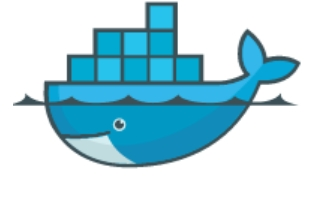
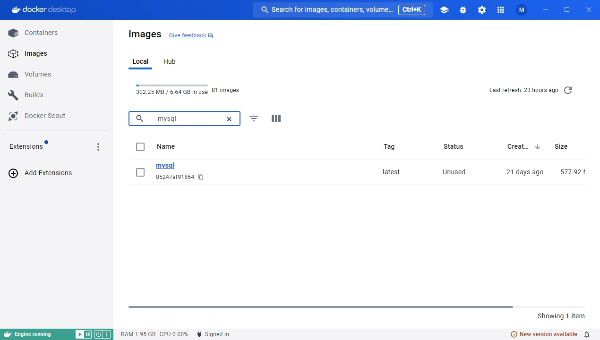
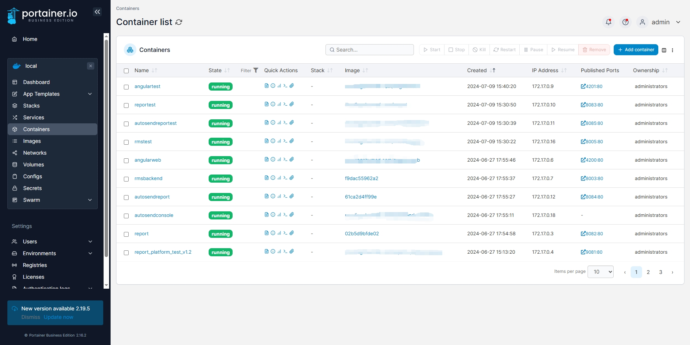

+++
title = 'Docker'
date = 2024-07-10T11:27:08+08:00
draft = false
+++

### Docker 心得

我对docker要比k8s熟的多,最近正好空，那就摸摸鱼吧

Docker，英文翻译为码头工人，它的logo是一直鲸鱼搭载着好几个集装箱，从这些就能看出它的含义，它是方便工程师更快捷地打包和部署应用的


### 安装

windows:docker desktop

linux:[linux安装](https://docs.docker.com/desktop/install/linux-install/)
### image

在 Docker 中，"image" 是一个不可变的文件系统快照，其中包含应用程序及其所有依赖项。它相当于一个模板，用来创建 Docker 容器

可以这么说，你应用程序的发布包就是一个镜像

### 构建镜像

构建镜像需要Dockerfile,示例

```yaml
# 基础镜像，用于构建
FROM mcr.microsoft.com/dotnet/sdk:7.0 AS build-env

# 设置工作目录
WORKDIR /app

# 复制 .csproj 文件并恢复依赖项
COPY *.csproj ./
RUN dotnet restore

# 复制项目文件
COPY . ./

# 编译项目
RUN dotnet publish -c Release -o out

# 基础镜像，用于运行
FROM mcr.microsoft.com/dotnet/aspnet:7.0

# 设置工作目录
WORKDIR /app

# 复制编译好的文件到工作目录
COPY --from=build-env /app/out .

# 设置容器启动时执行的命令
ENTRYPOINT ["dotnet", "my-dotnet-app.dll"]
```
运行命令

`docker build -t <image_name> -f Dockerfile .`

其中,"."是dockerfile相对于当前目录的路径

### container

在 Docker 中，"container"（容器）是基于镜像创建的一个可运行实例。可认为是一个虚拟机,你可以为它配置端口号,环境变量等等参数

### 创建容器

`docker run -d -p <external_port>:<internal_port> --name=<container_name> <image_name>`

-d 代表容器在后台运行

### 查看容器运行情况

`docker ps`

### volume

如果你创建了一个mysql数据库的容器，默认情况下，你的数据是保存在容器里的，如果容器被销毁，数据也就丢了，为防止丢失，我们需要将数据映射到外部
这时候就需要用到volume

指定volume

`docker run -d -p <external_port>:<internal_port> --name=<container_name> -v /path/to/host/directory:/path/to/container/directory <image_name>`

### docker compose

要创建一个容器需要这么多指令复杂容易记不住，那就配置一个yaml文件，然后用docker compose 命令，一键构建镜像，创建容器，首先创建一个yaml文件
```yaml
version: '3.8'

services:
  web:
    image: my-dotnet-app
    build:
      context: .
      dockerfile: Dockerfile
    ports:
      - "8080:80"
    volumes:
      - ./data:/app/data
    environment:
      - ASPNETCORE_ENVIRONMENT=Development
      - ConnectionStrings__DefaultConnection=Server=db;Database=mydb;User Id=myuser;Password=mypassword;
    depends_on:
      - db

  db:
    image: postgres:latest
    environment:
      POSTGRES_DB: mydb
      POSTGRES_USER: myuser
      POSTGRES_PASSWORD: mypassword
    volumes:
      - postgres_data:/var/lib/postgresql/data

volumes:
  postgres_data:
```

接着运行指令就可以了
`docker compose -f <filename>.yaml up -d`

### portainer

docker 打包部署指令太多记不住怎么办，咱们可以借助一些工具，我自己是这样的，写一个批处理命令，可以一键发布程序，构建镜像，推送镜像
服务端就用portainer自动拉取镜像，创建容器



### 总结

如今，docker是每一位后端程序员必学的东西了，docker容器就是一个小型虚拟机，涵盖了操作系统的基本配置。以往同一发布包迁移到新的服务器，还要再配置各种环境参数，有了docker就不用担心了，大大降低了运维成本
