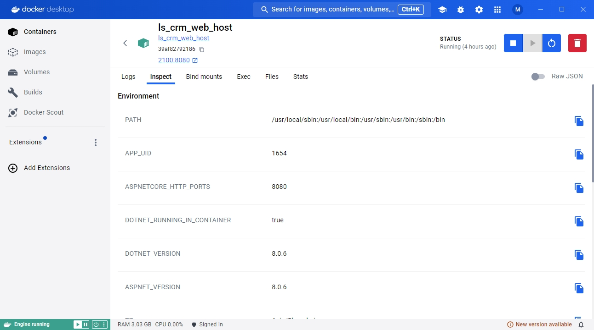
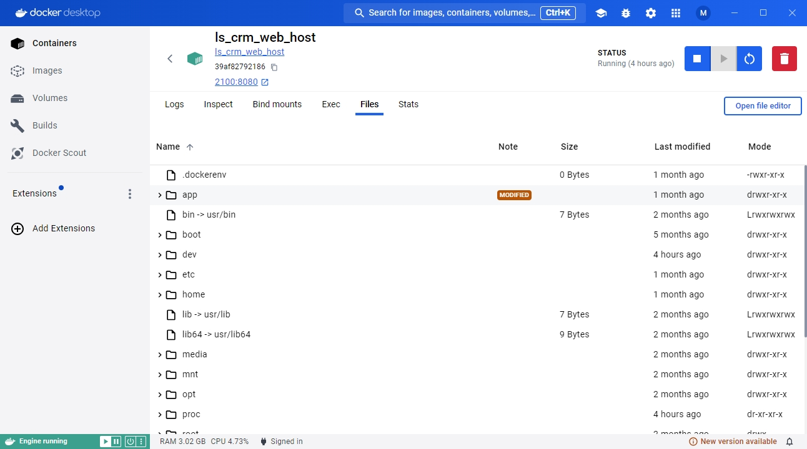
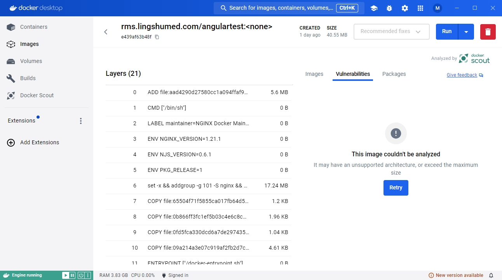
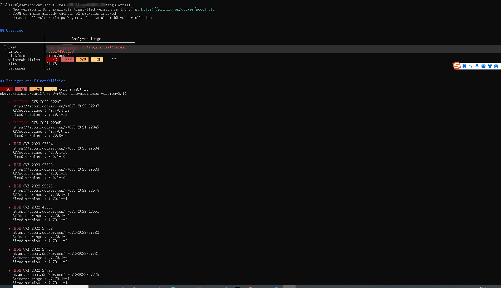

+++
title = 'Docker 进阶'
date = 2024-07-10T15:36:33+08:00
draft = false
+++

随笔写的，docker进阶教程

现在docker desktop 越来越强大，功能越来越多，用它来学习docker是不二之选

选择一个运行的容器，如图

#### logs

可以查看容器的运行日志

#### inspect

可以查看容器的所有配置参数，环境变量等

#### bind mounts

查看绑定的volume或者Mounts

#### exec

可以进入容器内部执行linux命令

#### files

查看容器内部的文件，其实容器就是一台小型虚拟机，部署的文件被放在app文件夹下

#### stats

查看docker容器当前状态

#### docker scout

这是一个Docker大概20.x（不记得是哪个）版本后新出的指令，可以检查你的镜像,并给出修改建议

这次有点奇怪,docker desktop上出不了结果，算了，就用命令行把

`docker scout cves <image_name>`

