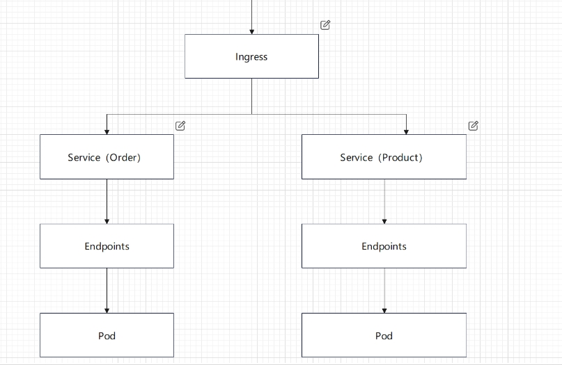

+++
title = 'K8s'
date = 2024-07-10T10:56:25+08:00
draft = false
+++

### K8s部署

最近公司上了k8s, 我只学了点皮毛,如能学好如虎添翼

### 前期准备

个人认为，学习K8S前必须掌握docker相关知识，否则学起来很困难

### linux上安装k8s
[教程](https://kubernetes.io/zh-cn/docs/tasks/tools/install-kubectl-linux/)

### 简要结构图


### ingress

在Kubernetes中，Ingress 是一个API对象，用于管理对集群内服务的外部访问，通常是 HTTP 和 HTTPS。Ingress 可以提供负载均衡、SSL 终止和基于名称的虚拟主机等功能

```yaml
apiVersion: networking.k8s.io/v1
kind: Ingress
metadata:
  name: example-ingress
spec:
  rules:
  - host: example.com
    http:
      paths:
      - path: /app1
        pathType: Prefix
        backend:
          service:
            name: app1-service
            port:
              number: 80
      - path: /app2
        pathType: Prefix
        backend:
          service:
            name: app2-service
            port:
              number: 80
  tls:
  - hosts:
    - example.com
    secretName: example-tls
```

### service

在Kubernetes中，Service 是一种用于定义逻辑集合的Pod及其访问策略的API对象。Service 提供了一种抽象，允许你将一组Pod作为一个单一的服务进行访问，而不需要知道这些Pod的具体位置或数量。Service 可以实现负载均衡、服务发现和故障转移等功能

```yaml
apiVersion: v1
kind: Service
metadata:
  name: my-service
spec:
  selector:
    app: MyApp
  ports:
    - protocol: TCP
      port: 80
      targetPort: 9376
```

### pod
在Kubernetes中，Pod 是最小的可部署计算单元。它是运行在集群上的容器或容器组的抽象。Pod 是Kubernetes中管理和调度容器的基本单元。

```yaml
apiVersion: v1
kind: Pod
metadata:
  name: my-pod
spec:
  containers:
  - name: my-container
    image: nginx:1.14.2
    ports:
    - containerPort: 80
```

写好配置文件后，只要执行一个命令即可

`kubectl apply -f <YAML-NAME>.yaml`

运行起来后可以通过这个命令查看所有pod情况

`kubectl get pods`

查看所有service情况

`kubectl get svc`

### 总结

k8s我也是新学,只了解皮毛而已，也难以讲清，大致流程就是这样，对docker熟悉的小伙伴更容易理解