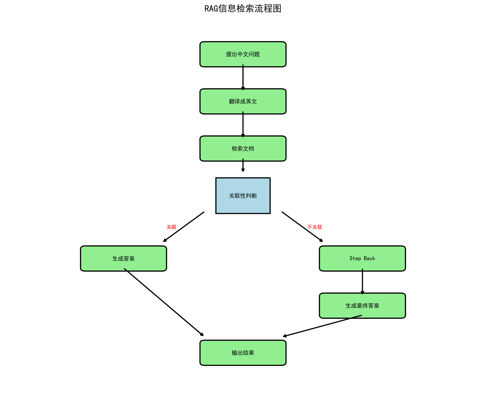

+++
title = '⭐Langchain--RAG信息检索'
date = 2025-08-15T13:36:40+08:00
draft = false
+++

## 简介

最近学习了用Langchain构建RAG（检索增强生成）信息检索链，这是目前业界主流的知识问答框架。通过实践发现这个框架功能强大且灵活，于是基于[rag from scratch课程](https://github.com/langchain-ai/rag-from-scratch.git)构建了一个巴萨球员知识库。

**值得注意的是，尽管当前AI在网页生成、后端开发等领域表现出色，但对于RAG系统的端到端代码生成，现有AI工具仍难以准确完成。这表明RAG领域的技术复杂性和专业性仍然需要人工深度参与，为开发者提供了独特的技术价值空间。**

### 主要流程



### 导入数据

用pandas这个库导入数据，得到结果如下

| Name | Description | Position | Record |
|------|-------------|----------|--------|
| marc-andre-ter-stegen | <details><summary>View</summary>Marc-André ter Stegen signed for FC Barcelona...</details> | goalkeeper | 422 apps / 174 CS / 986 saves |
| inaki-pena | <details><summary>View</summary>Iñaki Peña signed for Alicante CF when he was...</details> | goalkeeper | 45 apps / 10 CS / 90 saves |
| wojciech-szczesny | <details><summary>View</summary>FC Barcelona and the player Wojciech Szczęsny...</details> | goalkeeper | 30 apps / 14 CS / 66 saves |
| ronald-federico-araujo-da-silva | <details><summary>View</summary>Ronald Araujo was born in Rivera, Uruguay...</details> | defender | 175 apps / 10 G / 7 A |
| jules-kounde | <details><summary>View</summary>Jules Kounde was born in Paris on November 12...</details> | defender | 141 apps / 7 G / 18 A |
| pau-cubarsi | <details><summary>View</summary>Pau Cubarsí arrived at La Masia from Girona...</details> | defender | 80 apps / 1 G / 5 A |
| alejandro-balde | <details><summary>View</summary>Alejandro Balde, born in Barcelona to Guinean...</details> | defender | 126 apps / 3 G / 15 A |
| inigo-martinez-berridi | <details><summary>View</summary>Born in Ondarroa on 17 May 1991, a town in...</details> | defender | 71 apps / 3 G / 5 A |
| eric-garcia | <details><summary>View</summary>A player of massive potential, he is the class...</details> | defender | 114 apps / 6 G / 5 A |
| gavi | <details><summary>View</summary>A combative and technically gifted midfielder...</details> | midfielder | 153 apps / 10 G / 14 A |
| Pedri | <details><summary>View</summary>On September 2, 2019, FC Barcelona and Las Pal...</details> | midfielder | 202 apps / 26 G / 21 A |
| Pablo Torre | <details><summary>View</summary>In March of 2022 Barça reached an agreement...</details> | midfielder | 27 apps / 5 G / 4 A |
| fermin-lopez | <details><summary>View</summary>Fermín López Marín was part of the Campillo...</details> | midfielder | 88 apps / 19 G / 9 A |
| marc-casado | <details><summary>View</summary>Born in Sant Pere de Vilamajor in 2003 and...</details> | midfielder | 41 apps / 1 G / 6 A |
| dani-olmo | <details><summary>View</summary>An attack minded forward who can play anywhere...</details> | midfielder | 39 apps / 12 G / 6 A |
| de-jong | <details><summary>View</summary>Frenkie de Jong was born in Arkel (Netherlands...</details> | midfielder | 259 apps / 19 G / 21 A |
| ferran-torres | <details><summary>View</summary>Born on 29 February 2000 in Foios (Valencia)...</details> | forward | 158 apps / 44 G / 19 A |
| robert-lewandowski | <details><summary>View</summary>The striker from Poland stands out for his goa...</details> | forward | 147 apps / 101 G / 20 A |
| ansu-fati | <details><summary>View</summary>Anssumane Fati (31 October 2002) was born in...</details> | forward | 123 apps / 29 G / 6 A |
| raphael-dias-belloli-raphinha | <details><summary>View</summary>A technically proficient winger, with good dri...</details> | forward | 144 apps / 54 G / 45 A |
| pau-victor | <details><summary>View</summary>A versatile forward who can play as a striker...</details> | forward | 29 apps / 2 G / 1 A |
| lamine-yamal | <details><summary>View</summary>Lamine Yamal arrived at FC Barcelona at the ag...</details> | forward | 106 apps / 25 G / 28 A |
| Leo Messi | <details><summary>View</summary>Messi (Rosario, Argentina, 24 June 1987) is th...</details> | forward | 778 apps / 672 G / 269 A |
| xavi-hernandez | <details><summary>View</summary>If Barça is more than a club, then Xavi Hernán...</details> | midfielder | 767 apps / 87 G / 184 A |
| andres-iniesta | <details><summary>View</summary>Iniesta (Fuentealbilla, Albacete, 1984) was on...</details> | midfielder | 674 apps / 57 G / 139 A |
| ronaldinho | <details><summary>View</summary>With his trademark goal celebration and broad...</details> | forward | 207 apps / 94 G / 69 A |
| sergio-busquets | <details><summary>View</summary>Sergio Busquets (Sabadell, 16 July 1988), from...</details> | Midfielder | 722 apps / 18 G / 45 A |
| david-villa | <details><summary>View</summary>David Villa (Tuilla, Asturias, 1981) came to B...</details> | forward | 130 apps / 51 G / 24 A |
| pedro-rodriguez | <details><summary>View</summary>Pedro Rodríguez (Santa Cruz de Tenerife)...</details> | forward | 358 apps / 109 G / 62 A |
| Daniel Alves | <details><summary>View</summary>Dani Alves (Juazeiro, Brazil, 1983) is conside...</details> | defender | 431 apps / 24 G |
| luis-suarez | <details><summary>View</summary>Suárez, (Salto, Uruguay, 1987) was one of the...</details> | forward | 300 apps / 210 G |
| Samuel Eto'o | <details><summary>View</summary>Eto'o (Nkon, Cameroon, 1981) goes down in Bar...</details> | forward | 234 apps / 152 G |

我直接找的官网的数据，所以没有翻译成中文，就是每个球员在巴萨的生涯数据，包括出场次数，进球，助攻。

### 加载嵌入模型

```python
def get_embedding_model(embed_model):
    from langchain.embeddings import HuggingFaceEmbeddings
    embeddings = HuggingFaceEmbeddings(model_name=embed_model)
    return embeddings

embed_model = 'Qwen/Qwen3-Embedding-0.6B'
embeddings = get_embedding_model(embed_model)
embeddings
```

### 获取向量数据库

这里采用chroma作为向量数据库

```python
from langchain.schema import Document
docs=[Document(page_content=row['description']+'\n'+row['record']) for index, row in merged_df.iterrows()]

from langchain.text_splitter import RecursiveCharacterTextSplitter
def get_text_splitter(chunk_size=500, chunk_overlap=100):
    text_splitter = RecursiveCharacterTextSplitter(
        chunk_size=chunk_size,
        chunk_overlap=chunk_overlap,
    )
    return text_splitter
text_splitter = get_text_splitter()
split_docs = text_splitter.split_documents(docs)

from langchain_community.vectorstores import Chroma
def get_vector_store(embeddings, split_docs):
    vector_store = Chroma.from_documents(
        documents=split_docs,
        embedding=embeddings,
    )
    return vector_store
vector_store = get_vector_store(embeddings, split_docs)
```

### 获取retriever

```python
retriever = vector_store.as_retriever()
```

上面代码大致意思是指，将文档分割成一个个chunks，每个chunks大小为500字，然后把这些chunks存放到向量数据库中


### 定义llm

这里的llm指的是对话模型，而前面加载的是文本嵌入模型

llm模型可以选择本地模型或者在线模型

本地模型:这里的本地模型部署在ollama上

```python
    def get_ollama_llm(self, base_url, model_name):  # 添加self
        from langchain_ollama import ChatOllama
        llm=ChatOllama(base_url=base_url, model=model_name, temperature=0.0)
        return llm
```

在线模型：可选择GPT或者deepseek等

```python
  def get_online_llm(self, base_url, model_name):  # 添加self
        from langchain_openai import ChatOpenAI
        llm=ChatOpenAI(base_url=base_url, model=model_name, api_key="<your_api_key>", temperature=0.0)
        return llm
```

### 构建langgraph

LangGraph 是 LangChain 推出的工作流编排框架，专门用于构建多步骤的AI应用。它以图的形式管理复杂的推理流程，支持条件分支、循环和状态管理，特别适合构建需要多轮交互的智能代理系统。

我们根据流程图来构建自己的pipeline

#### 中译英

```python
  chinese_to_english_prompt = "You are a translation expert. If the question is in Chinese, translate it into English concisely. Use the above statement as the prompt.question:{question}"

  def translate_to_english(state):
      from langchain_core.prompts import ChatPromptTemplate
      from langchain_core.output_parsers import StrOutputParser
      translate_chain=ChatPromptTemplate.from_template(chinese_to_english_prompt) | llm | StrOutputParser()
      translated_question=translate_chain.invoke({"question": state['question']})
      return {"question": translated_question}

```

💡 这里要重点介绍LCEL（LangChain Expression Language）链式语法，这是LangChain库最核心的设计理念之一。当上一个组件的输出格式恰好匹配下一个组件的输入格式时，就可以用 `|` 符号将它们无缝连接起来，形成优雅的数据流管道。这种链式调用不仅让代码更加简洁易读，也体现了LangChain在组件设计上的精妙之处。

```python
prompt | llm
```

这句话等同于

```python
input_data={"question":'...',"context":'...'}
prompt_output=prompt.invoke(input_data)
llm_output=llm.invoke(prompt_output)
```

#### 检索

```python
def retrieve(self,state):
      query = state['question']
      retrieved_docs = self.retriever.get_relevant_documents(query)
      return {"question":state['question'], "context": retrieved_docs}
```

#### 检查问题与检索的文章是否关联

```python

class GradeDocuments(BaseModel):
    is_relevant: str=Field(description="Documents are relevant to the question, 'yes' or 'no'")

def get_grade_chain():  
      from langchain_core.prompts import ChatPromptTemplate

      system = """You are a grader assessing relevance of a retrieved document to a user question. \n 
      If the document contains keyword(s) or semantic meaning related to the question, grade it as relevant. \n
      Give a binary score 'yes' or 'no' score to indicate whether the document is relevant to the question."""
      grade_prompt = ChatPromptTemplate.from_messages(
      [
          ("system", system),
          ("human", "Retrieved document: \n\n {context} \n\n User question: {question}"),
      ]
      )
      structured_llm_grader=llm.with_structured_output(GradeDocuments)
      return grade_prompt | structured_llm_grader

def grade_documents(state):  # 添加self
      print("---CHECK DOCUMENT RELEVANCE TO QUESTION---")
      question = state["question"]
      context = state["context"]

      # Score each doc
      score = grade_chain.invoke(
         {"question": question, "context": context}
      )
      is_relevant="No"
      if score.is_relevant == "yes":
        print("---GRADE: DOCUMENT RELEVANT---")
        is_relevant = "Yes"
      else:
        print("---GRADE: DOCUMENT NOT RELEVANT---")
      return {"context": context, "question": question, "is_relevant": is_relevant}
```

如果关联，那么is_relevant=yes，否则就会为no

`with_structured_output` 方法可以将模型生成的结果，转换成一个对象