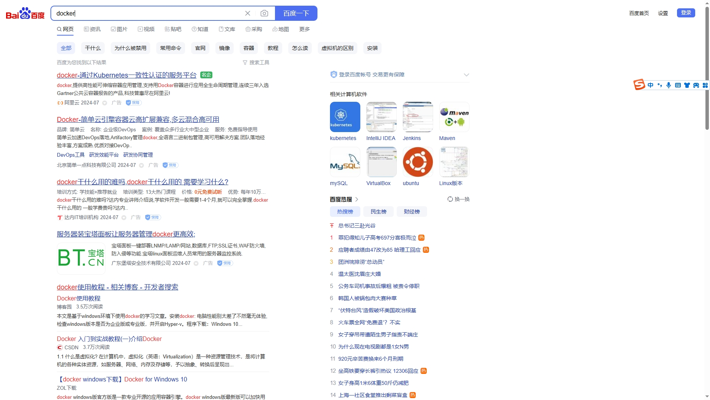
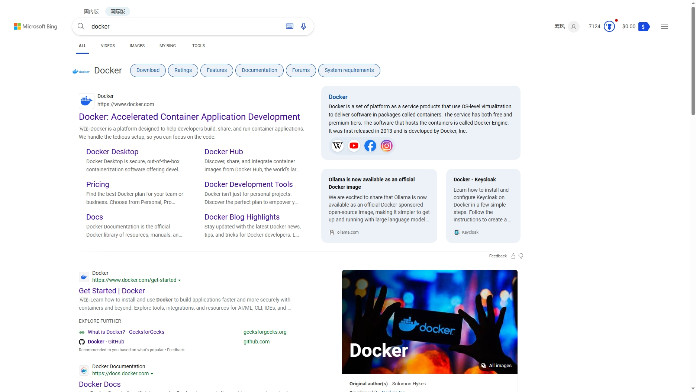

+++
title = '别用百度'
date = 2024-07-10T16:09:19+08:00
draft = false
+++

工作正好满10年了，说下个人学习心得

### 尽量别用百度,CSDN

我发现有许多工作多年的老程序员还是喜欢百度，这个真的是大忌，百度的质量大家有目共睹，直接上图

搜索docker，用百度看看出来的什么

再用必应国际版搜索

哪个是真正的docker教程，结果一目了然

百度给你的要么是广告，要么是CSDN，CSDN里面的东西大部分也都是抄过来的，抄也抄不全

[csdn的docker教程举例](https://blog.csdn.net/qq_34936541/article/details/104890251)

看完他的文章，你会部署docker吗

而必应和谷歌，给你指向的，就是docker的官网，里面有最全的官方教程

[docker官方文档](https://docs.docker.com/guides/docker-overview/)

很多刚入门的程序员第一步就走错了，我当时也是一样，学习的途径不正确，路只会越走越糊涂。

有同学说，官方文档全是英文啊，看不懂。我只是二本英语只过了四级，不懂的翻译一下，记一下，并不难。当然，我工作后经常阅读努力学习，现在英文肯定要比大学那时候好

而且，我发现一个窍门，同样一篇文章，如果全部翻译成了中文再阅读，理解的东西可能只有英文原版的百分之七十左右。翻译成了中文再去阅读，反而不知道说的是什么。所以尽量阅读英文原版，不要整段整段地翻译

所以如果你要学习docker，也别看我的教程，先去官网参照官方文档学习

### 总结

这是个人的小心得，也可以算是总纲。据我了解，百度的程序员也不用百度，不只计算机领域，科研领域的人应该也都知道，查资料都用谷歌学术