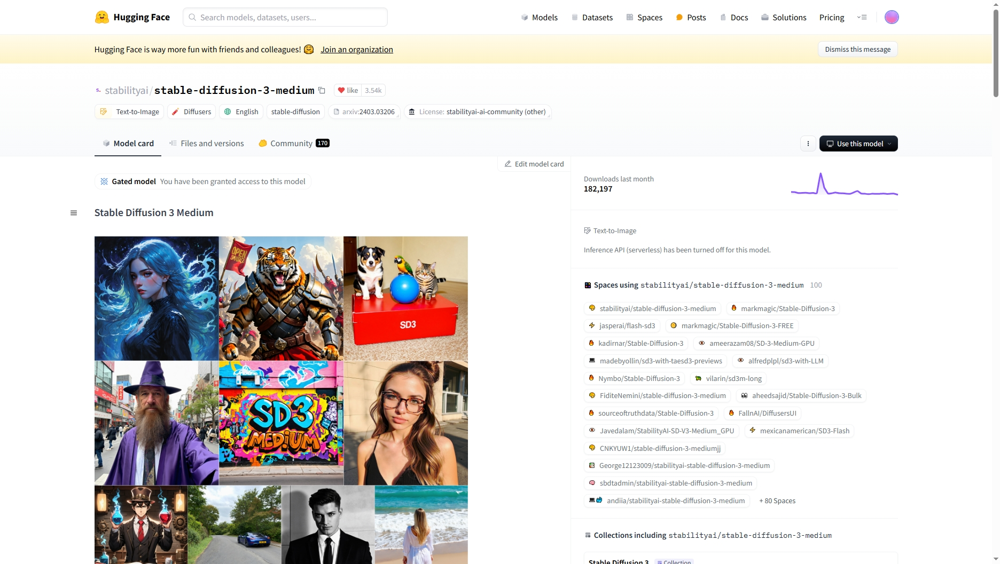
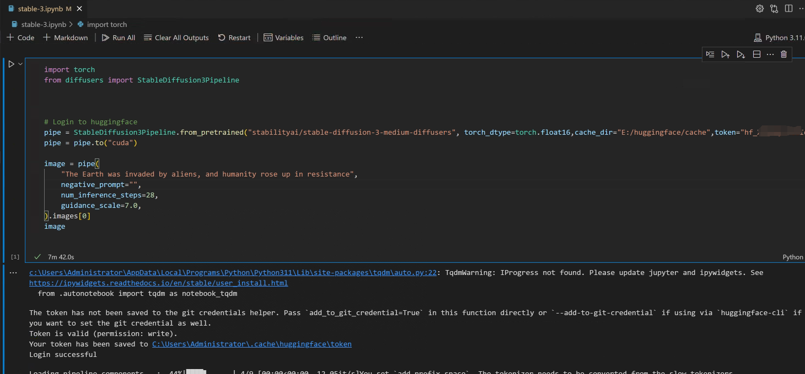
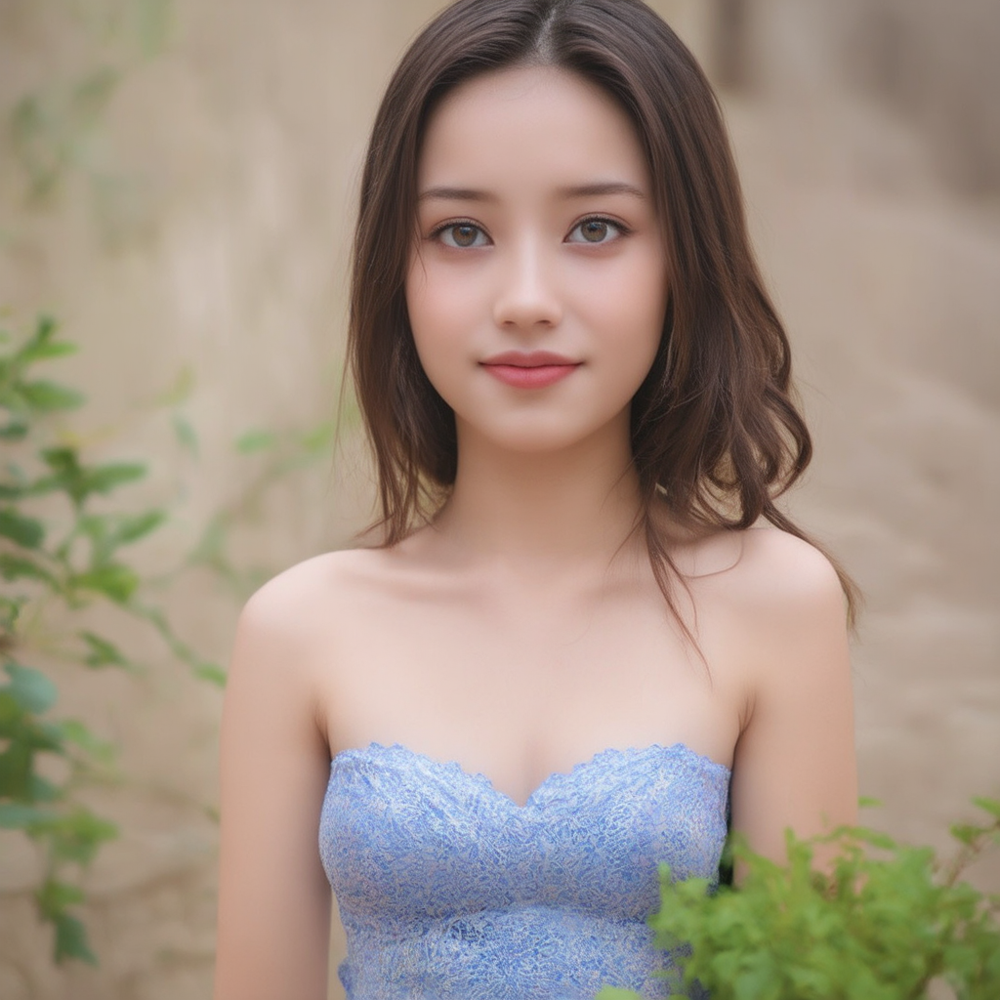

+++
title = '使用HuggingFace的模型来生成图像'
date = 2024-07-19T16:35:38+08:00
draft = false
+++

### Huggingface

[地址](https://huggingface.co/)

这个网站类似于github,github托管的是代码，而它托管的是模型



选择右侧use this model,或者看readme,可以得知它的用法

示例如下

```python
import torch
from diffusers import StableDiffusion3Pipeline

pipe = StableDiffusion3Pipeline.from_pretrained("stabilityai/stable-diffusion-3-medium-diffusers", torch_dtype=torch.float16,token="hf_xxxxxx")
pipe = pipe.to("cuda")

image = pipe(
    "A cat holding a sign that says hello world",
    negative_prompt="",
    num_inference_steps=28,
    guidance_scale=7.0,
).images[0]
image
```

这个token是你在huggingface上生成的，权限为write

刚开始运行有报错的话,按照错误提示去安装python的包

当然，你的PC上得有独显才行，还有装一个CUDA的显卡驱动，我显卡是RTX3060，CUDA 11.6



这个生成很慢，平均10分钟，可能跟本机显卡有关




这个模型我感觉整体上没有他们在线的api调用的那个模型好，不过也凑合能用