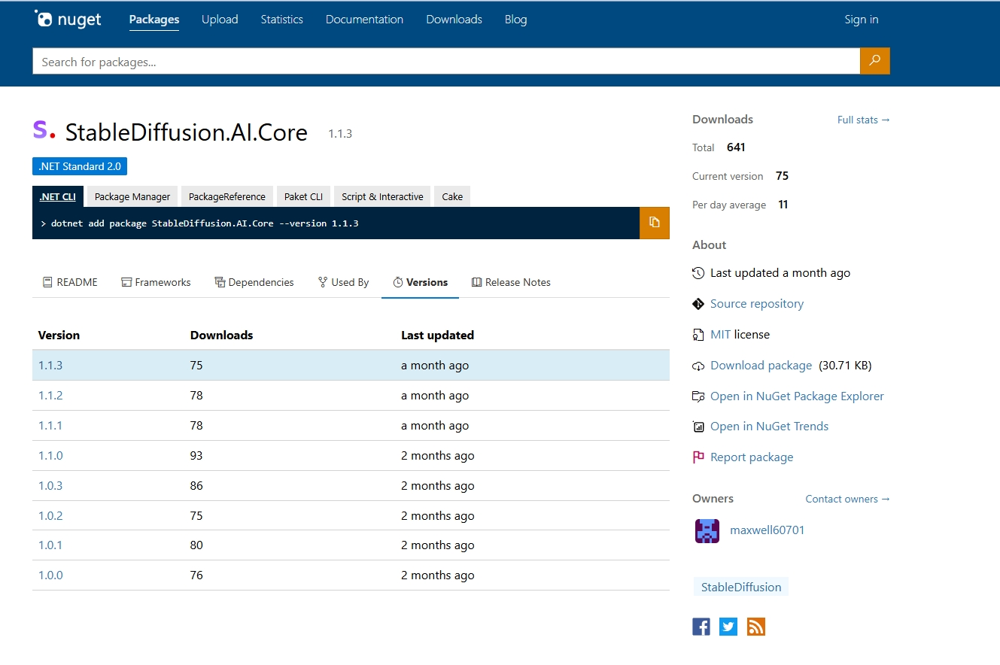

+++
title = 'Stablediffusion'
date = 2024-07-10T09:35:19+08:00
draft = false
+++

### 我自己写了一个nuget包,用以调用stablediffusion的webapi

[StableDiffusion.AI.Core](https://www.nuget.org/packages/StableDiffusion.AI.Core)
